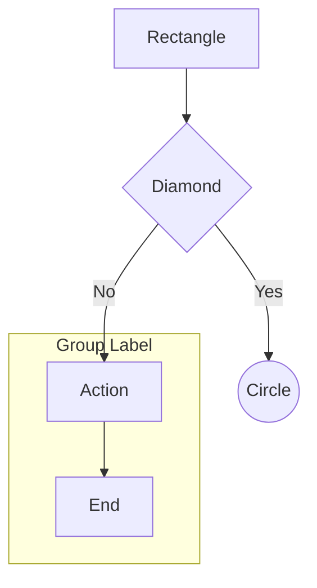
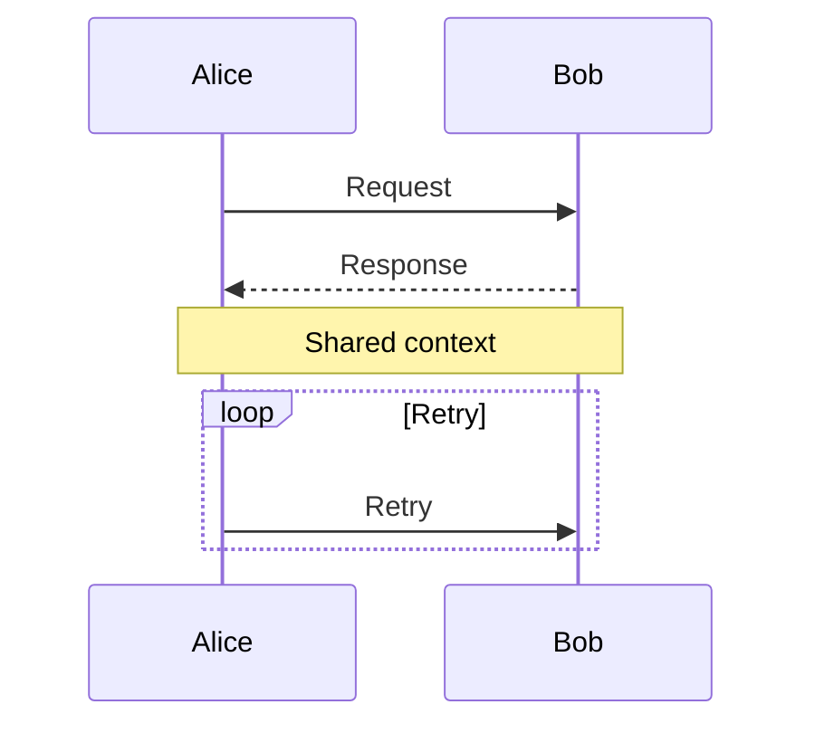
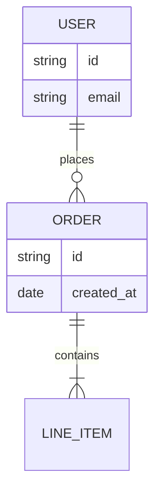
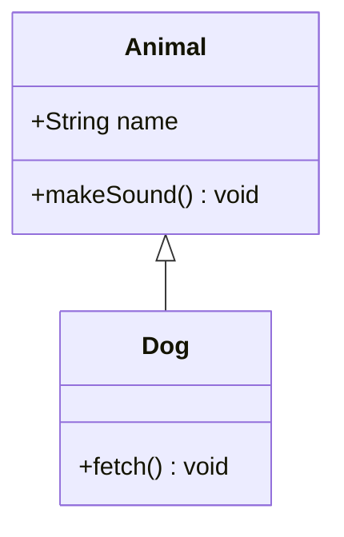
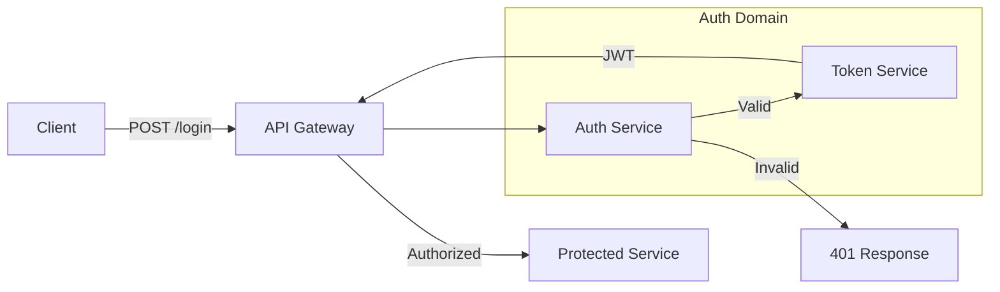

# Creating Diagrams

## Purpose

Create technical diagrams in Mermaid syntax (for code-friendly documentation) and optionally convert them to Excalidraw format (for interactive visual editing). Covers diagram type selection, Mermaid syntax, and the two-step Excalidraw conversion API.

## When to Use This Skill

- Creating architecture, flowchart, sequence, or ER diagrams
- Converting Mermaid diagrams to Excalidraw for visual collaboration
- Embedding diagrams in markdown, GitHub README, or Confluence
- Building React components that render interactive Excalidraw diagrams
- Exporting `.excalidraw` files from Mermaid source

## Output Format Decision

| Format                   | Best For                     | Key Tradeoff                      |
| ------------------------ | ---------------------------- | --------------------------------- |
| **Mermaid only**         | GitHub, markdown, Confluence | Git-diffable, all diagram types   |
| **Excalidraw only**      | Whiteboarding, presentations | Requires app, visual editing      |
| **Mermaid → Excalidraw** | Full flexibility             | Flowcharts only get native shapes |

**Rule of thumb:** Use Mermaid for documentation. Convert to Excalidraw when stakeholders need visual editing.

## Mermaid Diagram Types

### Excalidraw Conversion Support Matrix

| Diagram Type        | Mermaid | Excalidraw Conversion                                      |
| ------------------- | ------- | ---------------------------------------------------------- |
| `flowchart`         | ✅      | ✅ Native shapes (rectangles, diamonds, arrows, subgraphs) |
| `sequenceDiagram`   | ✅      | ⚠️ Renders as static image                                 |
| `erDiagram`         | ✅      | ⚠️ Renders as static image                                 |
| `classDiagram`      | ✅      | ⚠️ Renders as static image                                 |
| `gantt`, `gitGraph` | ✅      | ⚠️ Renders as static image                                 |

**If using Excalidraw conversion: write a `flowchart` for full interactive shapes.**

### Flowchart Syntax (Recommended for Excalidraw)



**Shapes supported natively in Excalidraw conversion:**

- `[text]` → Rectangle
- `{text}` → Diamond
- `((text))` → Circle
- `-->` / `---` / `==>` → Arrows with optional labels `|label|`
- `subgraph` → Frame/group

**Shapes that fall back to Rectangle in Excalidraw:**

- `[\text\]` subroutine, `[(text)]` cylindrical, `{{text}}` hexagon
- FontAwesome icons → Text only
- Markdown formatting → Plain text
- Cross arrow heads → Bar arrow heads

### Sequence Diagram



### ER Diagram



### Class Diagram



## Excalidraw Conversion

### Installation

```bash
npm install @excalidraw/mermaid-to-excalidraw @excalidraw/excalidraw
```

### Two-Step Conversion (Required)

```typescript
import { parseMermaidToExcalidraw } from "@excalidraw/mermaid-to-excalidraw";
import { convertToExcalidrawElements } from "@excalidraw/excalidraw";

async function convert(mermaidSyntax: string) {
  // Step 1: Parse Mermaid → skeleton elements
  const { elements, files } = await parseMermaidToExcalidraw(mermaidSyntax, {
    fontSize: 16, // optional, default applies
  });

  // Step 2: Convert skeleton → fully qualified Excalidraw elements
  const excalidrawElements = convertToExcalidrawElements(elements);

  return { excalidrawElements, files };
}
```

**Why two steps?** `@excalidraw/excalidraw` uses UMD builds that prevent tree-shakeable imports, so conversion is split across two packages.

**For full API reference, element structure, and error handling:**

```
Read `~/.claude/skills/creating-diagrams/references/EXCALIDRAW-API.md`
```

Use when: Embedding Excalidraw in React, exporting `.excalidraw` files, understanding element types, or debugging conversion errors.

## Examples

### Example 1: System Architecture Diagram (Mermaid)

**Request:** "Diagram a microservices auth flow"

**Output:**



### Example 2: React Component with Excalidraw

**Request:** "Render an architecture diagram interactively in React"

**Output:**

```tsx
import React, { useEffect, useState } from "react";
import { Excalidraw } from "@excalidraw/excalidraw";
import { parseMermaidToExcalidraw } from "@excalidraw/mermaid-to-excalidraw";
import { convertToExcalidrawElements } from "@excalidraw/excalidraw";

const DIAGRAM = `flowchart LR
    Client --> Gateway
    Gateway --> Service`;

export function ArchDiagram() {
  const [elements, setElements] = useState([]);
  const [files, setFiles] = useState({});

  useEffect(() => {
    parseMermaidToExcalidraw(DIAGRAM, { fontSize: 16 }).then(
      ({ elements, files }) => {
        setElements(convertToExcalidrawElements(elements));
        setFiles(files);
      },
    );
  }, []);

  return (
    <div style={{ height: "400px" }}>
      <Excalidraw initialData={{ elements, files }} />
    </div>
  );
}
```

### Example 3: Export .excalidraw File

**Request:** "Save the diagram as an Excalidraw file"

**Output:**

```typescript
import { parseMermaidToExcalidraw } from "@excalidraw/mermaid-to-excalidraw";
import { convertToExcalidrawElements } from "@excalidraw/excalidraw";
import { writeFileSync } from "fs";

const mermaid = `flowchart TD
    A[Start] --> B[Process] --> C[End]`;

const { elements, files } = await parseMermaidToExcalidraw(mermaid, {
  fontSize: 16,
});
const excalidrawElements = convertToExcalidrawElements(elements);

const excalidrawFile = {
  type: "excalidraw",
  version: 2,
  source: "https://excalidraw.com",
  elements: excalidrawElements,
  appState: { viewBackgroundColor: "#ffffff" },
  files,
};

writeFileSync("diagram.excalidraw", JSON.stringify(excalidrawFile, null, 2));
```

## Common Pitfalls

| Issue                                   | Cause                             | Fix                                                               |
| --------------------------------------- | --------------------------------- | ----------------------------------------------------------------- |
| Non-flowchart renders as image          | Only flowcharts get native shapes | Use `flowchart` for interactive elements                          |
| Missing shapes in Excalidraw            | Unsupported shape types           | Use `[]`, `{}`, `(())` only                                       |
| `convertToExcalidrawElements` not found | Wrong import                      | Import from `@excalidraw/excalidraw`, not `mermaid-to-excalidraw` |
| Parse error                             | Mermaid syntax issue              | Validate at mermaid.live first                                    |
| Markdown in labels stripped             | Known fallback                    | Use plain text labels                                             |
