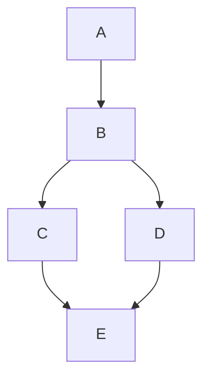

# Reviewing Diagrams

## Purpose

Audit Mermaid diagrams and Excalidraw conversion code for correctness, clarity, and compatibility. Reports findings by severity (P0–P3) with concrete fixes.

## When to Use This Skill

- Reviewing diagrams in a PR or documentation update
- Auditing a Mermaid diagram before converting to Excalidraw
- Reviewing React components that integrate Excalidraw
- Checking diagram quality (clarity, organization, complexity)

## Review Workflow

### Step 1: Identify What to Review

Determine the review scope:

| Target                          | What to Check                                     |
| ------------------------------- | ------------------------------------------------- |
| `.md` files with Mermaid blocks | Syntax, clarity, structure, Excalidraw compat     |
| `.excalidraw` JSON files        | File structure, element validity                  |
| React/TS files using Excalidraw | Two-step conversion, imports, error handling, SSR |

### Step 2: Apply Checklist

**Load the full checklist:**

```
Read `~/.claude/skills/reviewing-diagrams/CHECKLIST.md`
```

Use when: Starting any diagram review — it contains all P0–P3 checks with pass/fail criteria.

### Step 3: Report Findings

Use this output format:

```markdown
## Diagram Review: [filename or description]

### P0 - Critical (Must Fix)

- [ ] **[code]** [issue description] — Line/node: `[location]`

### P1 - High (Should Fix)

- [ ] **[code]** [issue description]

### P2 - Medium (Consider Fixing)

- [ ] **[code]** [issue description]

### P3 - Low (Nice to Have)

- [ ] **[code]** [issue description]

### Passed

- [x] [check that passed]
```

**If no issues found in a severity level, omit that section.**

## Severity Guide

| Level | Label    | Action                                               |
| ----- | -------- | ---------------------------------------------------- |
| P0    | Critical | Blocks merge — broken, incorrect, or misleading      |
| P1    | High     | Should fix — bad practice or compatibility issue     |
| P2    | Medium   | Consider fixing — clarity or maintainability concern |
| P3    | Low      | Nice to have — style or minor suggestion             |

## Quick Checks (No Checklist Needed)

These are the most common issues — spot-check these first:

**Mermaid:**

- Node IDs used as labels (`A --> B` with no `[text]`) → P1
- No `subgraph` on diagrams with 8+ nodes → P2
- Mixing `TD` and `LR` directions in one diagram → P2
- Non-flowchart used but Excalidraw conversion intended → P1

**Excalidraw conversion code:**

- Missing `await` on `parseMermaidToExcalidraw` → P0
- `convertToExcalidrawElements` imported from wrong package → P0
- No try/catch around parse call → P1
- Missing CSS import (`@excalidraw/excalidraw/index.css`) → P1
- No SSR guard in Next.js context → P1

## Example Review

**Input diagram:**



**Review output:**

```
## Diagram Review: architecture.md (flowchart)

### P1 - High (Should Fix)
- [ ] **M3** Raw node IDs as labels — Nodes A, B, C, D, E have no descriptive text.
      Fix: `A[Service A] --> B[Load Balancer]`

### Passed
- [x] Valid flowchart syntax
- [x] Consistent direction (TD)
- [x] No orphaned nodes
- [x] Excalidraw-compatible shapes only
```
